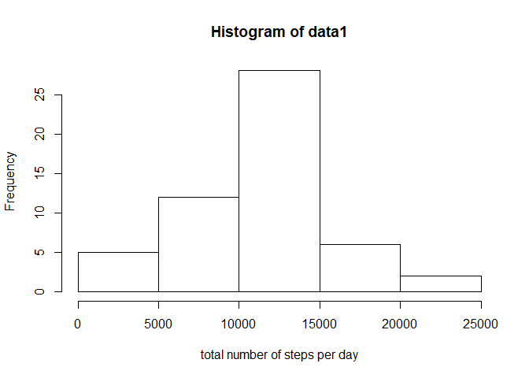
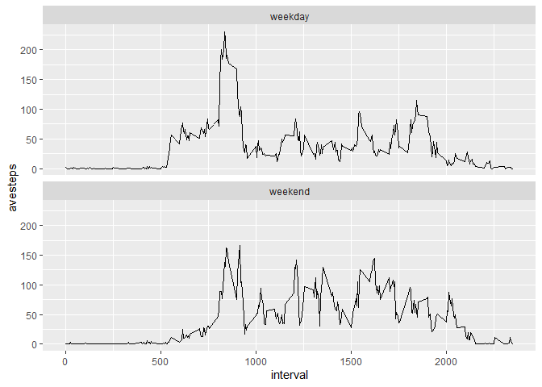

## Loading and preprocessing the data
1.Load the data

```r
data <- read.csv(unzip("activity.zip"),stringsAsFactors = F)
data0 <- data[!is.na(data$steps),]
```


## What is mean total number of steps taken per day?
1.Calculate the total number of steps taken per day

```r
data1 <- with(data0,tapply(steps,date,sum))
```

2.Make a histogram of the total number of steps taken each day

```r
hist(data1,xlab="total number of steps per day")
```

<!-- -->


3.Calculate and report the mean and median of the total number of steps taken per day

```r
summary(data1)
```

```
##    Min. 1st Qu.  Median    Mean 3rd Qu.    Max. 
##      41    8841   10765   10766   13294   21194
```

## What is the average daily activity pattern?

1.Make a time series plot (i.e. \color{red}{\verb|type = "l"|}type = "l") of the 5-minute interval (x-axis) and the average number of steps taken, averaged across all days (y-axis)

```r
library(dplyr)
```

```
## 
## Attaching package: 'dplyr'
```

```
## The following objects are masked from 'package:stats':
## 
##     filter, lag
```

```
## The following objects are masked from 'package:base':
## 
##     intersect, setdiff, setequal, union
```

```r
data11 <- group_by(data,interval)
data12 <- summarize(data11,avesteps=mean(steps,na.rm=T))
plot(data12$interval,data12$avesteps,type="l",xlab="interval",ylab="average")
```

<!-- -->

2.Which 5-minute interval, on average across all the days in the dataset, contains the maximum number of steps?

```r
data12[which.max(data12$avesteps),]$interval
```

```
## [1] 835
```


## Imputing missing values
1.Calculate and report the total number of missing values in the dataset

```r
nrow(data[is.na(data),])
```

```
## [1] 2304
```


3.Create a new dataset that is equal to the original dataset but with the missing data filled in

I decided to replace missing data with the mean for that 5 minutes interval.

```r
ndata <- data
n <- nrow(ndata)
for(i in 1:n){
  if(is.na(ndata[i,]$steps)){
    ndata[i,]$steps <- data12[data12$interval==ndata[i,]$interval,]$avesteps
  }
}
```

4.Make a histogram of the total number of steps taken each day and Calculate and report the mean and median total number of steps taken per day. 

```r
data4 <- with(ndata,tapply(steps,date,sum))
hist(data4,xlab="total number of steps per day",main="Histogram with missing data filled in")
```

<!-- -->

```r
summary(data4)
```

```
##    Min. 1st Qu.  Median    Mean 3rd Qu.    Max. 
##      41    9819   10766   10766   12811   21194
```

I can say the impuct of imputing missing data is very small.
Mean isn't different from one after missing data filled in.
Median increased slightly.
This result is because I replace missing data with the mean for the interval.

## Are there differences in activity patterns between weekdays and weekends?

1.Create a new factor variable in the dataset with two levels – “weekday” and “weekend” indicating whether a given date is a weekday or weekend day.

```r
weekdays <- weekdays(as.Date(ndata$date,"%Y-%m-%d"))
##translate Japanese into English
weekdays <- gsub("月曜日","weekday",weekdays)
weekdays <- gsub("火曜日","weekday",weekdays)
weekdays <- gsub("水曜日","weekday",weekdays)
weekdays <- gsub("木曜日","weekday",weekdays)
weekdays <- gsub("金曜日","weekday",weekdays)
weekdays <- gsub("土曜日","weekend",weekdays)
weekdays <- gsub("日曜日","weekend",weekdays)
ndata$weekdays <- weekdays
```

2.Make a panel plot containing a time series plot (i.e. \color{red}{\verb|type = "l"|}type = "l") of the 5-minute interval (x-axis) and the average number of steps taken, averaged across all weekday days or weekend days (y-axis). See the README file in the GitHub repository to see an example of what this plot should look like using simulated data.


```r
library(ggplot2)
ndata1 <- group_by(ndata,weekdays,interval)
ndata2 <- summarize(ndata1,avesteps=mean(steps))
g <- ggplot(ndata2,aes(interval,avesteps))
g + geom_line() +
  facet_wrap(~weekdays,ncol=1)
```

<!-- -->


